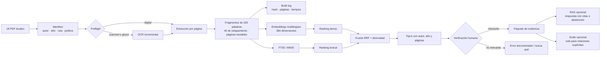

# Mapa del sistema: 18 libros completos

El sistema separa preparación, recuperación, evaluación y síntesis. Esa
separación permite reemplazar o mejorar una etapa sin fingir que otra ya está
resuelta.

## Qué se produjo

| capa | artefacto | evidencia |
| --- | --- | --- |
| corpus | `manifest-full-books.csv` | 18 obras únicas con autor y año |
| calidad | `preflight-report-full-books.json` local | cero bloqueos full-scan |
| OCR | `ocr_cache/` local | 2,637 procesadas; 2,606 con texto; cero fallos |
| índice | `local_index_full/` local | 8,669 páginas; 14,726 fragmentos |
| trazabilidad | `page_ledger.jsonl` local | fuente PDF/OCR por página |
| evaluación | preguntas + qrels + pool exportado | 12 preguntas; 123 candidatos; 6 sin juzgar |
| resultados | `evaluation-report-full-books.md` | lexical/dense/hybrid comparables |
| docencia | deck, runbooks y demo congelada | pipeline explicable y repetible |
| audio | `20260804-000749_embeddings-y-rag-con-18-libros-completos.mp3` · 8:19 | relato de proceso, hallazgos y límites, con G2/G4 aprobados |
| aprobación | `approval-checklist.md` | G2 y G4 aprobados por Kristian; 6 casos aceptados sin juicio |

## Tres salidas distintas

1. **Buscar pasajes:** lexical, dense o hybrid.
2. **Redactar con evidencia:** RAG, después de evaluar el recuperador.
3. **Responder relaciones:** grafo ligero, solo si la pregunta exige aristas
   auditables entre autores, métodos, datasets, poblaciones o resultados.

Los microdatos siguen un cuarto camino: SQL sobre DuckDB o Parquet. Se indexan
sus diccionarios y metodologías; no se transforman millones de observaciones en
embeddings.
