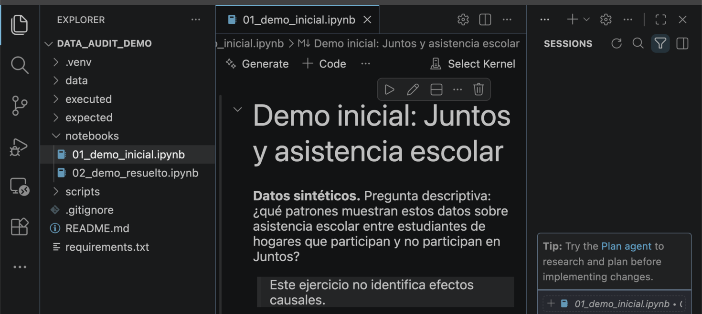

## El error que no da error

Un análisis puede correr entero, sin advertencias, y aun así responder
sobre una población distinta de la que declaramos.

::: {.lead}
Hoy no depuramos un fallo. Auditamos un resultado que parecía correcto.
:::

::: {.prompt}
Codex propone · el kernel ejecuta · nosotros decidimos qué significa
:::

::: {.notes}
Minuto 0:00. Doce minutos y medio en total, incluido un pequeño colchón para
la latencia del agente.

Frase de entrada, literal: «Este notebook no tiene errores. Ese es el
problema.»

Fijar desde el inicio el reparto de papeles que se repite en las tres frases
de la banda inferior: el agente lee, diagnostica y propone; el kernel es quien
ejecuta; la persona interpreta y firma. Nadie del público debería salir
pensando que el demo trata de escribir pandas más rápido.

No adelantar el número 155 ni la palabra «merge». El demo depende de que la
sala vea primero un resultado creíble.

[Sources]
- Demo reproducible del taller, `course/exercises/data_audit_demo/`.
- Guía pública del facilitador,
  `materials/guides/guia-demo-jupyter-vscode-codex.pdf`.
[/Sources]
:::

## El montaje



::: {.prompt}
Sin claves de API · sin servidor Jupyter manual · todo local
:::

::: {.notes}
Minuto 0:25.

La imagen es una captura real de la carpeta del ejercicio abierta en VS Code:
Explorer a la izquierda, notebook en el centro y Codex a la derecha. Mostrar
la ventana real durante quince segundos y nombrar esos tres elementos con el
cursor. No convertirlo en un tutorial de botones: quien
quiera instalar tiene la guía completa en los materiales.

Decir en voz alta el punto que la gente suele saltarse: abrir la carpeta y no
solo el notebook es lo que hace que las rutas relativas funcionen y que el
agente pueda relacionar el código con los datos. La captura conserva el estado
auténtico de primera apertura; antes del demo hay que confiar en la carpeta y
seleccionar el kernel `.venv`.

Si alguien pregunta por el costo: la extensión de Codex trabaja con una
cuenta de ChatGPT y no requiere clave de API; Claude Code hace lo mismo desde
la terminal con una cuenta de Claude. El demo no depende de cuál se use.

Comprobación previa a la clase: kernel `.venv` seleccionado, notebook resuelto
ejecutado una vez y vuelto a cerrar, chat de Codex nuevo, terminal cerrada.
Copiar `01_demo_inicial.ipynb` y `data/` a una carpeta temporal limpia y abrir
esa carpeta en VS Code; no incluir el notebook resuelto, `expected/` ni
`scripts/`. El agente puede leer la carpeta completa, no solo el archivo activo.

Fallback global: si Codex no responde o no hay red, leer los cinco prompts en
voz alta y mostrar las celdas ya ejecutadas en `executed/`. El demo trata del
procedimiento, no de la latencia del modelo.

[Sources]
- `materials/guides/guia-demo-jupyter-vscode-codex.pdf`, secciones 3 a 7.
- Captura local real de VS Code, carpeta `course/exercises/data_audit_demo/`,
  2 de agosto de 2026.
[/Sources]
:::

## La pregunta

¿Qué patrones descriptivos muestran estos datos sobre asistencia escolar
entre estudiantes de hogares que participan y no participan en Juntos?

::: {.lean-code}
```text
data/estudiantes.csv            716 filas
data/caracteristicas_hogar.csv  280 hogares
```
:::

::: {.prompt}
Datos sintéticos · no son ENAHO, no son cifras oficiales, no identifican efectos
:::

::: {.notes}
Minuto 0:45.

Leer la pregunta completa en voz alta, incluida la palabra «descriptivos». Es
la única defensa contra la conclusión causal que la sala va a querer sacar
sola en el minuto diez.

Decir dos veces que los datos son sintéticos y generados con semilla fija.
Existen 360 hogares en el estudio y solo 280 en el módulo auxiliar; ese hueco
es el mecanismo del demo, pero todavía no hay que señalarlo.

Si alguien pregunta por qué el módulo auxiliar está incompleto: porque así
suelen llegar los módulos administrativos reales, con cobertura desigual por
territorio.

[Sources]
- `course/exercises/data_audit_demo/expected/metadata.json`.
[/Sources]
:::

## El primer resultado

::: {.lean-code}
```text
   juntos  estudiantes  asistencia_media
0       0          351             0.809
1       1          210             0.867
```
:::

::: {.lead}
Brecha descriptiva: 0.058. En la salida no hay ninguna advertencia: nada aquí
pide una revisión.
:::

::: {.prompt}
¿Qué comprobarían ustedes antes de aceptar esta comparación?
:::

::: {.notes}
Minuto 1:10. Ejecutar en vivo las celdas de carga y la tabla inicial.

Hacer la pregunta de la banda inferior y sostener el silencio treinta
segundos completos. Es incómodo y es el punto: si el agente habla primero, la
sala solo asiente.

Respuestas frecuentes y qué hacer con cada una: «el tamaño de muestra» —
anotarla, es exactamente la puerta de entrada; «controles» o «variables
omitidas» — legítimo, pero pertenece al minuto diez, aparcarla en voz alta;
«significancia estadística» — responder que un intervalo alrededor de una
muestra equivocada sigue siendo una respuesta sobre la población equivocada.

Si nadie habla: «¿alguien sabe cuántos estudiantes hay en esta tabla?». Ahí
suele empezar la conversación.

Fallback si el kernel falla: la tabla ya está en la lámina y el notebook
inicial está preejecutado en `executed/01_demo_inicial.ipynb`; seguir sin
ejecutar y decirlo.

[Sources]
- `course/exercises/data_audit_demo/expected/resultados_esperados.md`.
- `course/exercises/data_audit_demo/executed/01_demo_inicial.ipynb`.
[/Sources]
:::

## Comprender antes de editar

::: {.lean-code}
```text
Lee únicamente 01_demo_inicial.ipynb y los datos que usa.
No consultes 02_demo_resuelto.ipynb, expected/ ni
scripts/generate_demo.py.
Sin modificar archivos, resume la pregunta, la población
y cada transformación que pueda cambiar el número o la
composición de las observaciones. Señala incertidumbres.
```
:::

::: {.lead}
El primer prompt no pide código. Pide una lectura.
:::

::: {.prompt}
«Sin modificar archivos» es la parte que hay que copiar siempre
:::

::: {.notes}
Minuto 2:20. Prompt 1 de cinco. Pegarlo en Codex con el notebook abierto y
esperar la respuesta en pantalla.

Copiar el prompt visible. Subrayar las cuatro restricciones que lo hacen útil:
acota los archivos, evita que el notebook resuelto revele la solución, prohíbe
editar y define qué transformaciones buscar.

Mientras responde, explicar por qué se empieza así. Un agente al que se le
pide «arregla esto» produce un cambio que hay que auditar; un agente al que se
le pide «explícame esto» produce una hipótesis que podemos comprobar nosotros.

La respuesta de Codex varía entre ejecuciones. Lo que debe aparecer es una
mención al `merge` como operación capaz de cambiar el número de filas. Si no
aparece, decirlo con honestidad y pedirlo de nuevo nombrando la celda: el
demo no depende de que el modelo acierte a la primera.

[Sources]
- `materials/guides/guia-demo-jupyter-vscode-codex.pdf`, sección 8, paso 1.
[/Sources]
:::

## La línea que cambia la población

::: {.lean-code}
```python
analisis = estudiantes.merge(
    hogares,
    on='hogar_id',
    how='inner',
)
```
:::

::: {.lead}
`how='inner'` es una decisión sobre quién entra en el estudio, escrita como si
fuera una opción técnica.
:::

::: {.prompt}
Python no protesta: hacer un cruce con pérdida es sintaxis perfectamente válida
:::

::: {.notes}
Minuto 3:10.

Señalar la línea con el cursor y no explicarla todavía. Preguntar: «¿quién ha
escrito esto esta semana?». Casi todas las manos.

El punto conceptual del demo entero: los errores que rompen el código se
arreglan en cinco minutos porque el intérprete los denuncia. Los errores que
cambian la muestra sobreviven a la revisión por pares porque no dejan rastro
en la pantalla.

Cuatro operaciones comparten esa propiedad y conviene nombrarlas: un merge que
no conserva todas las filas, un `dropna` sin conteo, un filtro escrito antes
de definir la población, y una desduplicación con clave equivocada.

[Sources]
- `course/exercises/data_audit_demo/notebooks/01_demo_inicial.ipynb`, celda
  del merge.
[/Sources]
:::

## Diagnosticar antes de corregir

::: {.lean-code}
```text
No corrijas todavía el notebook. Propón celdas
diagnósticas para localizar dónde se pierden
observaciones: conteos antes y después, un indicador
de merge y tasas de no correspondencia por Juntos,
ruralidad y distrito.
```
:::

::: {.prompt}
Segundo prompt · seguimos sin autorizar una sola edición
:::

::: {.notes}
Minuto 3:55. Prompt 2 de cinco. Añadir al pegarlo: «No consultes
`02_demo_resuelto.ipynb`, `expected/` ni `scripts/generate_demo.py`.»

Explicar el patrón mientras Codex responde: pedir la corrección antes del
diagnóstico deja sin evidencia; pedir el diagnóstico primero deja un rastro
que se puede revisar, ejecutar y discutir.

Codex propondrá celdas. Revisar el resumen, mirar el diff si edita el
notebook, aceptar solo lo que se entiende y ejecutar nosotros. Verbalizar los
cuatro pasos: leer, entender, aceptar, ejecutar.

Si propone además la corrección: usarlo como ejemplo en vivo de por qué hay
que leer el diff. Aceptar las celdas de diagnóstico, rechazar el cambio del
merge, decir en voz alta que se rechaza y por qué.

Fallback: las mismas celdas están en `notebooks/02_demo_resuelto.ipynb`.

[Sources]
- `materials/guides/guia-demo-jupyter-vscode-codex.pdf`, sección 8, pasos 2 y 3.
[/Sources]
:::

## 716 → 561

::: {.completions}
- 716 estudiantes antes del cruce
- 561 después
- 155 desaparecen sin un solo mensaje de error
:::

::: {.prompt}
Tasa global de correspondencia: 78.4 %
:::

::: {.notes}
Minuto 4:50. Ejecutar la celda de conteos y dejar el número en pantalla.

Decir la frase literal: «El código corre, pero cambió quién está en los
datos.»

Contexto de escala para que 155 no suene pequeño: es más de una de cada
cinco observaciones, y la tabla del minuto 1:10 se calculó entera sobre las
que quedaron.

Si alguien pregunta por qué el merge pierde filas: la tabla auxiliar tiene 280
hogares de los 360 del estudio; un `inner` conserva únicamente a los
estudiantes cuyo hogar aparece en ambas tablas.

Aún no revelar el sesgo por zona. La siguiente lámina es el giro.

[Sources]
- `course/exercises/data_audit_demo/expected/resultados_esperados.md`.
[/Sources]
:::

## Quién desapareció

::: {.completions}
- urbana — 91.9 % de correspondencia
- rural — 68.2 %
:::

::: {.lead .fragment}
La pérdida no es ruido: es una submuestra con otra composición.
:::

::: {.prompt}
Por distrito el rango va de 98.4 % a 65.0 %
:::

::: {.notes}
Minuto 5:45. Ejecutar las tasas por zona y por distrito.

Este es el clímax analítico del demo. Dar tiempo antes de hacer clic en la
frase revelada.

El argumento en una línea: si la pérdida fuera aleatoria costaría precisión;
como es sistemática, cambia la población. La proporción de estudiantes de
hogares Juntos pasa de 41.5 % a 37.4 %, porque la cobertura auxiliar es peor
justamente donde Juntos es más frecuente.

Pregunta a la sala si hay tiempo: «¿en cuántos estudios que han leído sabrían
decir si esto ocurrió?». No pedir respuesta, dejarla en el aire.

[Sources]
- `course/exercises/data_audit_demo/expected/metadata.json`,
  `match_rate_by_zone` y `match_rate_by_district`.
[/Sources]
:::

## La corrección mínima

::: {.lean-code}
```python
auditoria = estudiantes.merge(
    hogares,
    on='hogar_id',
    how='left',
    indicator=True,
    validate='many_to_one',
)
```
:::

::: {.prompt}
Tercer prompt · «el cambio mínimo que conserve todos los estudiantes»
:::

::: {.notes}
Minuto 6:50. Prompt 3 de cinco: «Ya confirmamos que el inner merge elimina
observaciones de manera desigual. Propón el cambio mínimo que conserve todos
los estudiantes durante la auditoría: el tipo de cruce, un indicador de
correspondencia y una validación de la cardinalidad esperada. No alteres
todavía la definición final de la muestra. No consultes
`02_demo_resuelto.ipynb`, `expected/` ni `scripts/generate_demo.py`.»

Tres palabras hacen el trabajo y conviene señalarlas una por una: `left`
conserva a los 716; `indicator=True` deja constancia de quién correspondió;
`validate='many_to_one'` falla si la tabla auxiliar tuviera hogares
duplicados, un error distinto que este cruce no puede permitirse.

Mostrar el diff antes de aceptar. Si Codex propone además imputar los valores
faltantes, rechazarlo en vivo: imputar es una decisión de investigación, no
una corrección técnica, y el prompt pedía el cambio mínimo.

Fallback: si Codex no propone `indicator` o `validate`, escribirlos a mano y
decirlo en voz alta. El agente propone; el criterio de auditoría lo ponemos
nosotros.

[Sources]
- `course/exercises/data_audit_demo/notebooks/02_demo_resuelto.ipynb`,
  sección 1.
[/Sources]
:::

## Convertir el hallazgo en una comprobación

::: {.lean-code}
```python
auditoria['en_tabla_auxiliar'] = (
    auditoria['_merge'].eq('both')
)

assert len(auditoria) == len(estudiantes)
assert auditoria['estudiante_id'].is_unique
assert auditoria['en_tabla_auxiliar'].mean() >= 0.70
```
:::

::: {.lead}
El diagnóstico de hoy solo protege el análisis si queda escrito en el código.
:::

::: {.prompt}
Cuarto prompt · una comprobación que falle es la única que sirve
:::

::: {.notes}
Minuto 7:45. Prompt 4 de cinco: «Añade tres comprobaciones explícitas: una debe
detectar cambios no autorizados en el número de estudiantes; otra debe fallar
si `estudiante_id` deja de ser único; la tercera debe fallar si la tasa de
correspondencia del merge baja del umbral definido. Explica por qué elegiste
cada comprobación. No consultes `02_demo_resuelto.ipynb`, `expected/` ni
`scripts/generate_demo.py`.»

Ejecutar. Imprime «Comprobaciones superadas». Después hacer la demostración
que convence: cambiar `0.70` por `0.80` y volver a ejecutar para que la
aserción falle en pantalla. Una comprobación que nunca se ha visto fallar no
se ha probado.

El umbral 0.70 es una decisión nuestra, no un estándar. Decirlo. La ventaja de
escribirlo es que queda visible y discutible; hoy está implícito en casi todos
los pipelines de investigación.

Ahí está el puente con la sesión de Lean: una aserción es una afirmación sobre
los datos que una máquina puede rechazar.

Fallback: si Codex no produce las tres aserciones, pegarlas desde la lámina y
pedir a la sala que prediga cuál fallará al cambiar 0.70 por 0.80.

[Sources]
- `course/exercises/data_audit_demo/notebooks/02_demo_resuelto.ipynb`,
  sección 2.
[/Sources]
:::

## Para este descriptivo, el merge sobraba

La característica auxiliar no entra en el descriptivo. Se cruzó por costumbre,
no por necesidad.

::: {.lead}
La tabla se calcula sobre los 716 estudiantes; la cobertura auxiliar se
reporta aparte.
:::

::: {.prompt}
La pregunta define la población · el código no debería definirla por accidente
:::

::: {.notes}
Minuto 8:50.

Es la lección que la sala no espera y la que más se transfiere. El arreglo no
era un merge mejor: era notar que ese cruce no participaba en el cálculo. El
`left merge` sirvió para auditar la cobertura, no para construir la muestra.

Formularlo como regla portátil: escribir la población analítica antes de
escribir la primera transformación, y volver a leerla cada vez que una línea
pueda cambiar el número de filas.

Si alguien objeta que en su caso el cruce sí es necesario: correcto, y
entonces la muestra reducida es una decisión declarada, con su tasa de
correspondencia reportada. Lo que no es aceptable es que la decisión la tome
un argumento por defecto.

[Sources]
- `course/exercises/data_audit_demo/notebooks/02_demo_resuelto.ipynb`,
  sección 3.
[/Sources]
:::

## La brecha auditada

::: {.lean-code}
```text
       muestra    n  brecha_descriptiva
0     completa  716               0.077
1  inner merge  561               0.058
```
:::

::: {.lead}
El error silencioso no solo encogió la muestra: redujo el descriptivo cerca de
una cuarta parte.
:::

::: {.prompt}
Quinto prompt · separar descripción de causalidad
:::

::: {.notes}
Minuto 9:45. Prompt 5 de cinco: «Compara la tabla inicial y la tabla auditada.
Separa claramente: 1) lo que estos descriptivos muestran; 2) explicaciones
alternativas; 3) lo que no puede interpretarse causalmente. No redactes una
conclusión causal. No consultes `02_demo_resuelto.ipynb`, `expected/` ni
`scripts/generate_demo.py`.»

Los números: 0.802 frente a 0.879 en la muestra completa; 0.809 frente a 0.867
en la reducida. La diferencia entre 0.077 y 0.058 no es de precisión, es de
población.

La dirección importa para el argumento: el sesgo del merge atenuaba la brecha.
Podría haber ido en el otro sentido. Nadie lo sabía antes de medirlo, y esa es
la razón para medirlo siempre.

La última frase del prompt —«no redactes una conclusión causal»— es
deliberada. Sin ella, un modelo redacta una con gusto, y sonará bien.

Fallback: si la respuesta mezcla descripción y causalidad, leer directamente
las tres categorías del prompt y clasificar una frase con la sala.

[Sources]
- `course/exercises/data_audit_demo/expected/metadata.json`,
  `descriptive_gap_full` y `descriptive_gap_inner_merge`.
[/Sources]
:::

## Lo que la corrección no compra

::: {.quad}
- Recuperamos la población analítica declarada
- Recuperamos el descriptivo
- No obtuvimos identificación
- No obtuvimos un contrafactual
:::

::: {.lead}
0.077 es una diferencia entre grupos, no un efecto de Juntos.
:::

::: {.prompt}
Ruralidad, territorio, selección de hogares: siguen ahí después del arreglo
:::

::: {.notes}
Minuto 10:40. La lámina que no se puede saltar aunque el reloj apriete.

Un análisis auditado y una conclusión válida son cosas distintas. Todo lo que
hicimos garantiza que la comparación es sobre la población que declaramos; no
dice nada sobre por qué los dos grupos difieren.

Nombrar las explicaciones alternativas concretas: los hogares Juntos son más
rurales por diseño del programa; la elegibilidad no es aleatoria; hay
características de los hogares que no observamos.

Si alguien pide el diseño que sí identificaría: decir que existe —
discontinuidad en la elegibilidad, variación en el momento de expansión — y
que no cabe en este demo. La honestidad de decirlo vale más que un esquema
apurado.

[Sources]
- `course/exercises/data_audit_demo/expected/resultados_esperados.md`,
  resultado pedagógico.
[/Sources]
:::

## El reparto de papeles

::: {.rules}
- Codex lee, diagnostica y propone
- El kernel ejecuta
- Nosotros revisamos, interpretamos y firmamos
:::

::: {.prompt}
Cinco prompts, ninguna edición aceptada sin leer el diff
:::

::: {.notes}
Minuto 11:25.

Repasar los cinco prompts en veinte segundos: explica sin editar; diagnostica
sin corregir; corrige lo mínimo; convierte el hallazgo en comprobación; separa
descripción de causalidad.

Ninguno pedía una respuesta. Los cinco pedían un procedimiento que nosotros
pudiéramos ejecutar y verificar. Esa es la diferencia entre usar el agente
como oráculo y usarlo como colaborador auditable.

La responsabilidad epistemológica no se delega: el artículo lo firmamos
nosotros.

[Sources]
- `materials/guides/guia-demo-jupyter-vscode-codex.pdf`, sección 9.
[/Sources]
:::

## Para replicarlo

Los datos, los dos notebooks, los cinco prompts y los resultados esperados:

::: {.materials-link}
[github.com/kmlv/TeachResearchGenAI/.../data_audit_demo](https://github.com/kmlv/TeachResearchGenAI/tree/main/course/exercises/data_audit_demo)
:::

::: {.prompt}
Salida: tomar el último cruce que escribieron y contar las filas antes y después
:::

::: {.notes}
Minuto 11:45.

La carpeta se regenera de forma determinista con `scripts/generate_demo.py` y
se comprueba con `scripts/validate_demo.py`, así que los números de estas
láminas son verificables.

El notebook resuelto es la clave del facilitador. Sugerir que no lo abran
antes de intentar la auditoría por su cuenta.

Ejercicio de salida, literal: «Abran el último análisis propio que incluya un
merge, un dropna o un filtro. Cuenten las filas antes y después. Si el número
cambió, averigüen quién desapareció.»

Si se hará la lámina de transferencia, no leer aquí el ejercicio de salida:
esa misma consigna se convierte en los cinco minutos de práctica.

Cerrar con la frase: «Codex propuso; el kernel ejecutó; nosotros decidimos qué
significa.»
:::

## Ahora transfieran el patrón

::: {.rules}
- Definan la población y pregunten si la transformación hace falta
- Cuenten antes y después de cada transformación
- Describan quién entra, sale o se duplica
- Dejen una comprobación y una decisión escrita
:::

::: {.prompt}
Cinco minutos · su último merge, filtro, `dropna` o desduplicación
:::

::: {.notes}
Minuto 12:30. Ejercicio opcional de cinco minutos, después de cerrar la
demostración en la lámina anterior. Si este slideshow se usa solo para el demo
del facilitador, terminar allí.

Decir: «Ahora no repitan mis clics. Apliquen el patrón a una transformación de
su propio trabajo. Si no tienen un proyecto a mano, usen el `inner merge` del
notebook inicial y redacten la comprobación que querrían conservar.»

Producto observable: una nota de cuatro líneas con población, conteo,
composición de la pérdida y comprobación. Pedir a una pareja que intercambie
las notas y marque cuál de las cuatro piezas falta.

Si nadie trae código: usar como respaldo un filtro de edad o un `dropna` sobre
ingresos y preguntar qué grupo podría desaparecer más.
:::
